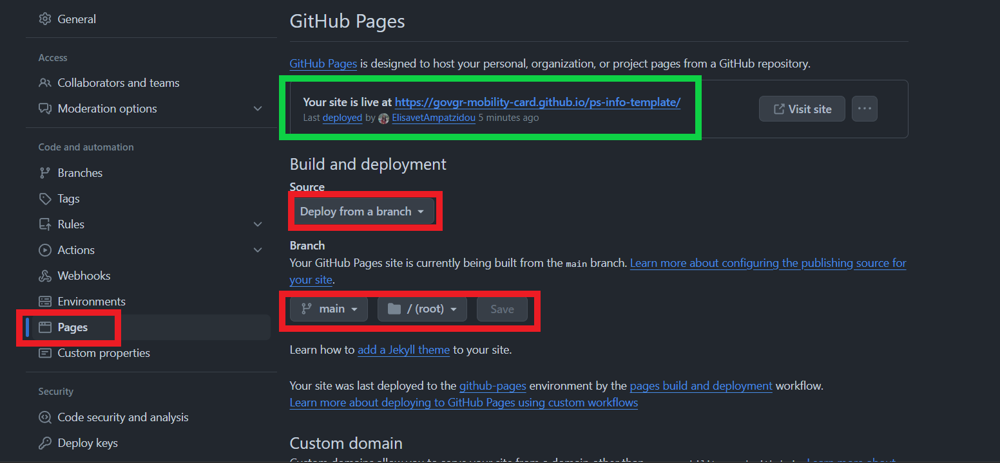

# ps-info-template

Case Study you can use as a template to create a web-based dialog system that covers the information stage of a public service. This system includes two main elements, a questionnaire and a number of questions (with their answers) that are frequently asked by citizens about this service, known as FAQs. It was created in order to inform citizens whether or not they are eligible for the public service and to provide information on the documents required.

You can visit the web-based dialogue system [here](https://govgr-mobility-card.github.io/info-for-mobility-card-gr/).

## Requirements

To use and modify this project, you need the following:

- A modern web browser (Chrome, Firefox, Safari, etc.)
- Visual Studio Code (VSCode) or another code editor
- Live Server extension for VSCode \*\* (or an equivalent development server like Apache)
- Basic knowledge of HTML, CSS, and JavaScript

\*\* [Live Server Extension](https://marketplace.visualstudio.com/items?itemName=ritwickdey.LiveServer): Go to the Extensions view by clicking on the Extensions icon in the Sidebar or pressing Ctrl+Shift+X. Search for "Live Server" and install the extension by Ritwick Dey (OR search with id = ritwickdey.LiveServer). 

## Setup Instructions

### 1. Download the Repository

First, download this repository to your local machine.

### 2. Open the project folder in VSCode:

Open the project folder in VSCode and start the Live Server (click 'Go Live' at the bottom-right). You will see a port number, e.g., "Port:XXXX". Open the HTML file you want to preview in the browser using this port (e.g., http://localhost:5500/).

## Navigating the Project

The project structure is as follows:

```sh
project
│
├── index.html # Main HTML file
├── styles.css # Custom CSS styles
├── js/
│ ├── jquery-functions.js # Custom jQuery functions to fetch Questions, Evidences, FAQs and to handle answers in the questionnaire
│ └── change-language-functions.js # Language switch functions
├── questions-utils/
│ ├── all-questions-en.json # has all questions&answers in english
│ ├── all-questions.json # has all questions&answers in greek
│ ├── cpsv-en.json # has all Evidences in english
│ ├── cpsv.json # has all Evidences in greek
│ ├── faq-en.json # has all FAQs questions&answers in english
│ ├── faq.json # has all FAQs questions&answers in greek
└── README.md # Project documentation
```
## Deployment Instructions

(Note: You should already have uploaded your project to a github repo)

To deploy your site to GitHub Pages, follow these steps: 

1.Make the repository public (unless you have a GitHub Pro account, which allows private repositories to be deployed).

2.Go to the repository's settings:
- Navigate to your repository on GitHub.
- Click on the "Settings" tab at the top of the repository page.

3.Select "Pages" from the menu:
- On the left-hand side of the settings page, find and click on "Pages".

4.Configure the deployment source:
- In the "Source" section, select "Deploy from a branch".
- Choose the branch you want to deploy. It is recommended to merge all your branches into the main branch and deploy from there for simplicity and consistency.

Here’s a visual guide to the steps:
<div float="left">
  
</div>

After successfully completing the previous steps, wait a few seconds and refresh the page. You should see the deployment URL at the topp of the Page (green box in the screenshot).

Note: Once set up, any changes pushed to the main branch will be automatically deployed to GitHub Pages.

By following these steps, your site will be live and accessible via the provided URL.

## Acknowledgments

This project was developed as part of a thesis assignment. Special thanks to our professors and mentors for their guidance and support.
